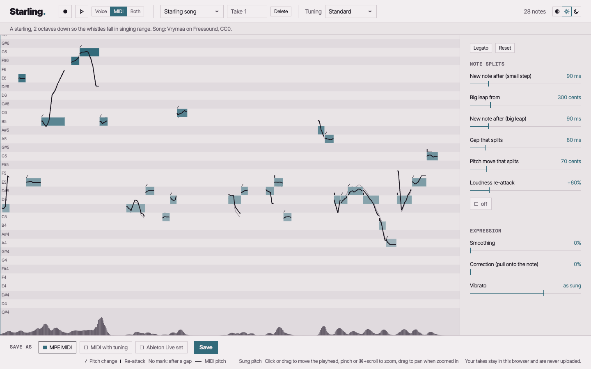

# Starling

simply sing.

Formerly voxmpe; the code, crates and commands keep that name.

Your voice as MIDI, every slide and in-between note included. Starling tracks a sung phrase with CREPE, splits it into notes, and writes MPE MIDI that keeps the voice's slides, vibrato and loudness on each note. It works in standard tuning or any other: the comma tuning of Turkish makam music, quarter tones, or any Scala tuning you bring.

## In pictures

Files to share: [loop, Paper](media/loop-paper.mp4) · [loop, Night](media/loop-night.mp4) · [still, Paper](media/studio-paper.png) · [still, Night](media/studio-night.png)

## Studio

    voxmpe studio

Opens a local page where you record (or open) a take, move the note-split settings while listening, and save or drag the `.mid` into Ableton Live. Takes and exports go to `takes/` in the current folder (`--takes DIR` to change it).

## CLI

    voxmpe convert take.wav -o take.mid --legato --hold-ms 150

Each flag is one of the studio's settings (`--hold-ms` is Hold (small moves), `--legato` the Legato button); `voxmpe convert --help` lists them all.

## Browser studio

The same studio, running entirely in the browser with CREPE tiny (2 MB): no
install, takes kept in the browser.

    python scripts/export_crepe.py tiny     # once: models/crepe-tiny.onnx
    cd studio-ui && npm install
    npm run build:web                       # site in studio-ui/web-dist
    npm run preview:web                     # try it at http://localhost:4318
    npm run e2e:web                         # headless Chrome check

`build:web` also needs `wasm-pack` and the `wasm32-unknown-unknown` Rust target
(`rustup target add wasm32-unknown-unknown`).

`scripts/deploy-web.sh --stage DIR` stages the site. CI builds it on every push to
`main` and publishes it to this repo's GitHub Pages:
https://swwallowws.github.io/starling/

## Setup

Needs Rust, Node, and Python with torch, torchcrepe and onnxruntime (for the model export).

1. Get the CREPE model: see `models/README.md`.
2. Build the UI once: `cd studio-ui && npm install && npm run build`.
3. `cargo install --path crates/voxmpe` (or `cargo run --release -p voxmpe -- studio`).

`voxmpe convert take.wav -o take.als` writes an Ableton Live 12 set instead of MIDI.
With a tuning other than 12-TET the set opens with that tuning loaded, the
notes are its steps (the same numbers as the "MIDI + tuning for Live 12"
export) and each note's pitch curve holds only its glides and vibrato.

The `.als` writer comes from
[expressive-liveset](https://github.com/swwallowws/expressive-liveset), a git
dependency fetched over SSH. That repo is private for now, so the build fails
without access to it.

## Tests

    cargo test --release          # Rust; tests that need the CREPE model skip without it
    cd studio-ui && npm test      # UI

## Layout

- `crates/voxmpe-core`: the engine library (pitch tracking, segmentation, MPE MIDI writer).
- `crates/voxmpe`: the app (studio, CLI, Scala tuning).
- `crates/voxmpe-web`: the engine for the browser studio's Web Workers.
- `studio-ui`: the studio's browser UI, for both the local and the browser studio.

No takes or model weights are in this repo: takes stay in `takes/`
(or in the browser), and the model is exported locally.

## License

MIT, see `LICENSE`.

Third-party material it downloads or ships:

- CREPE pitch model weights (Jong Wook Kim et al., 2018): MIT. Exported locally
  from the [torchcrepe](https://github.com/maxrmorrison/torchcrepe) package
  (Max Morrison, 2020, MIT) by `scripts/export_crepe.py`; not committed.
- Fonts in `studio-ui/vendor/design/fonts`: Inter Tight and Geist Mono, SIL Open
  Font License 1.1 (license texts next to the fonts).
- The instrument sounds the studio plays its MIDI with,
  `studio-ui/vendor/design/sound/gm.sf3`: made from GeneralUser GS 2.0.3 by
  S. Christian Collins ([schristiancollins.com](http://www.schristiancollins.com)),
  under the GeneralUser GS License v2.0, trimmed and stored as SoundFont 3. What
  was changed, and the licence in full, are in
  `studio-ui/vendor/design/sound/NOTICE`.
- The synth that plays them, in `studio-ui/vendor/design/sound/spessasynth`
  (the design system's shared build, synced with `--sound`): spessasynth_lib
  4.3.14 and spessasynth_core by spessasus, Apache License 2.0 (`LICENSE` and
  `NOTICE` there).
